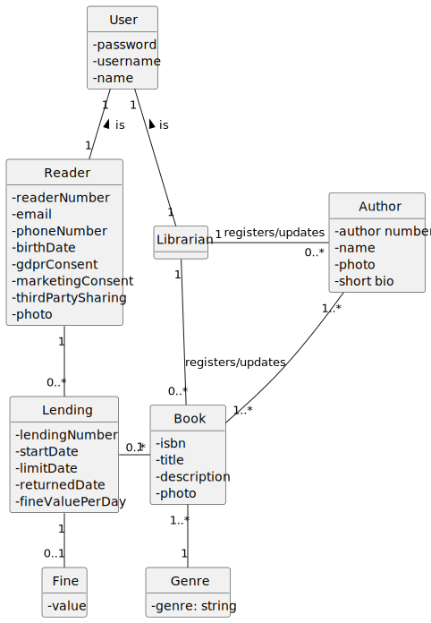
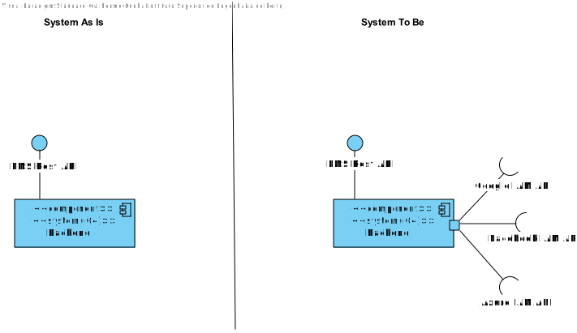
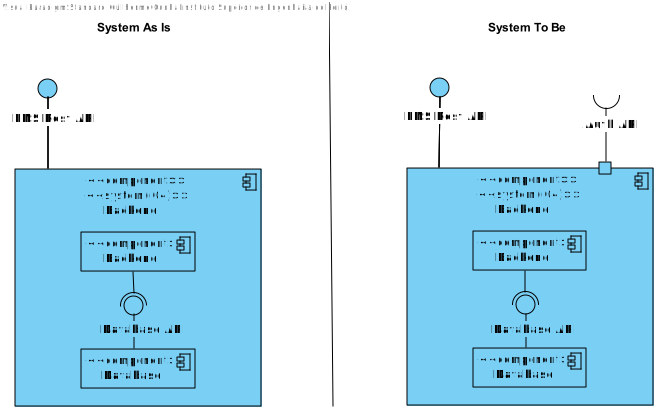
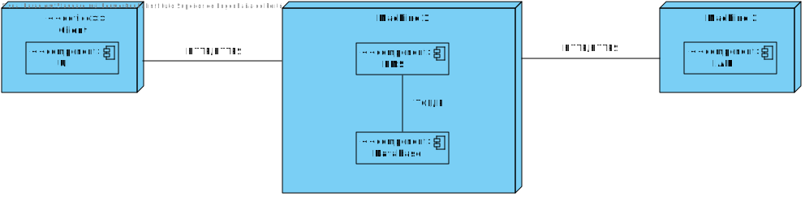
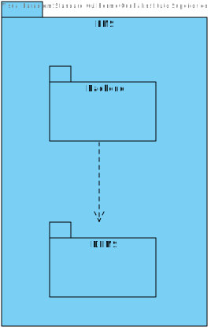
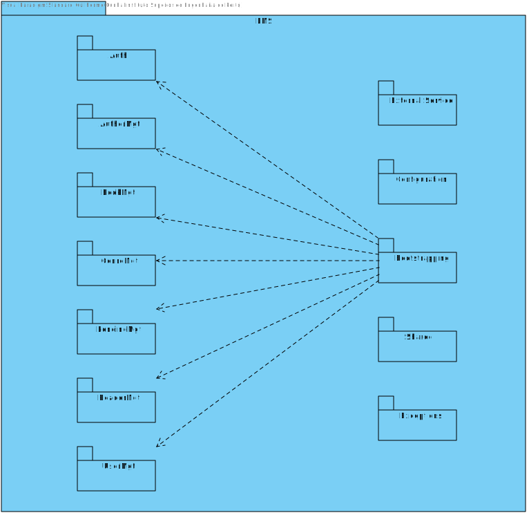
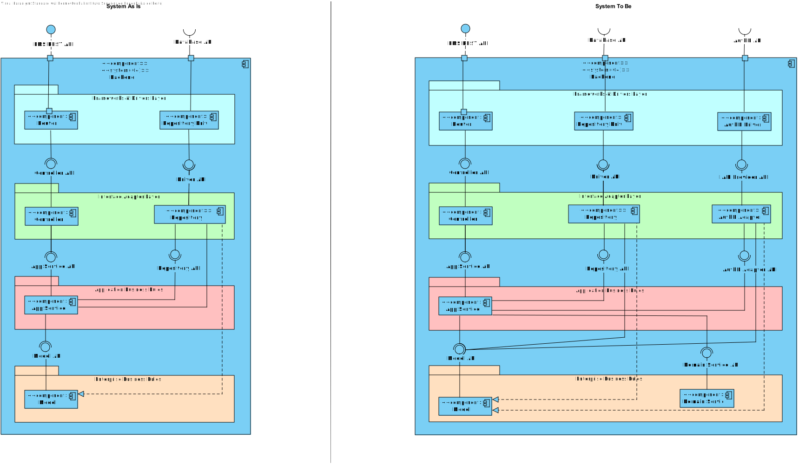
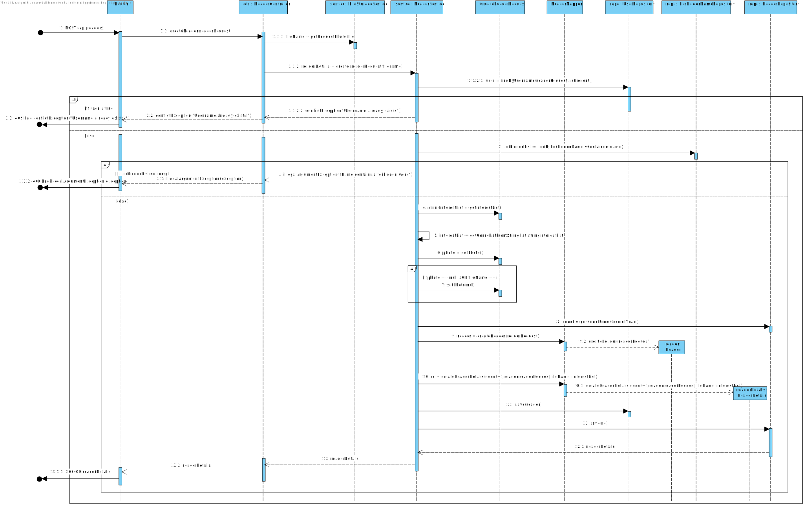
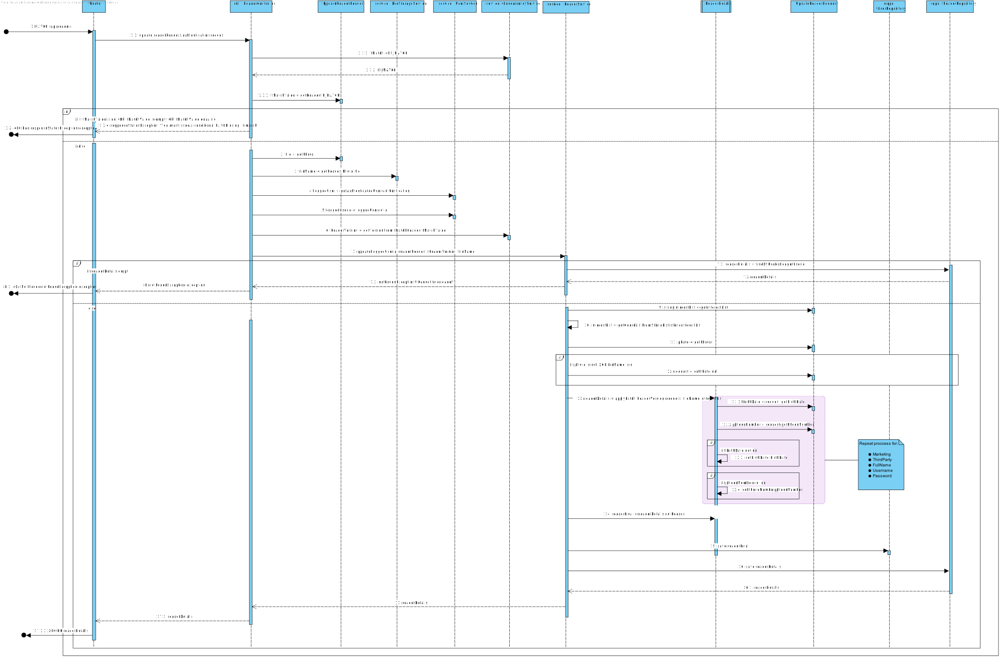
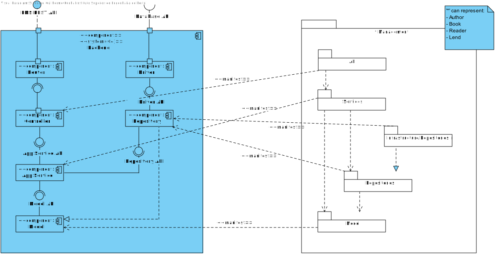

# System Architecture Design

## 1. Introduction

This document presents the system architecture design, offering a comprehensive overview of the project's structure, key components, 
and interaction patterns. The architecture is crafted to ensure scalability, maintainability, and modularity, a
ligning with current project requirements and anticipated future needs.

## 2. System Overview

In response to evolving requirements, the system architecture has been restructured and is presented in two distinct views: "System As Is" and "System To Be." The "As Is" view represents the original architecture, while the "To Be" view illustrates the proposed future-state architecture.

### Domain Model

### 2.1 Level 1

#### 2.1.1 Logical View

The initial architecture was composed solely of a backend, handling business logic and data access. With new requirements, the architecture now includes an external LMS API and an external Auth API alongside the backend, introducing additional service interactions.

#### 2.1.2 Implementation View

This view represents the current system implementation, where the backend incorporates various Identity and Access Management (IAM) services and interfaces with an LMS REST API.

### 2.2 Level 2

#### 2.2.1 Logical View

The Level 2 Logical View depicts the proposed architecture, comprising a backend, an external LMS API, and a Database API. This design introduces modular service interactions to support future scalability.

#### 2.2.2 Physical View

The Physical View displays the system’s deployment setup. The backend interacts with an external client via HTTP/HTTPS, incorporating IAM for secure access, and is designed for efficient resource handling.

#### 2.2.3 Implementation View

The Level 2 Implementation View details the proposed implementation, showcasing backend integration with a Database Management System in the LMS.

### Level 3

#### 2.3.1 Implementation View

The LMS API acts as the system’s entry point, exposing endpoints for resources like authors, books, readers, and lendings. Components within the backend include:
- **API**: Endpoint exposure for resource interaction.
- **Service**: Business logic processor for API requests, coordinating data operations.
- **Repository**: Data access and persistence layer.
- **Model**: Core system entities (Author, Book, Reader, Lending) for data manipulation.

#### 2.3.2 Logical View

##### System As Is

The current layered architecture comprises:
- **Frameworks and Drivers**: Interfaces with external services and directs requests to appropriate controllers.
- **Interface Adapter Layer**: Connects the Controller and Router for handling API requests.
- **Application Business Rules**: Manages application-specific business logic.
- **Enterprise Business Rules**: Core system entities and logic within the Model component.

##### System To Be

The target architecture adds components for enhanced functionality, such as:
- **Frameworks and Drivers Layer**: AuthN Driver for external authentication.
- **Interface Adapter Layer**: AuthN Adapter managing data and authentication access.
- **Application Business Rules**: App Service managing new business rule connections.
- **Enterprise Business Rules**: Domain Service handling domain-specific logic separate from the data model.

### Sequence Diagrams

This diagram illustrates the sequence of actions when a user creates a reader. The backend requests the external LMS API to create the reader, which then returns a response.

This sequence diagram details the user’s request for personal data, where the backend queries the external Auth API and relays the response.

### Level 4

#### Implementation Logical View Level 4 vs Logical View Level 3

This diagram contrasts the system’s implementation and logical views. The system incorporates an API Gateway for seamless backend communication with external services.

Key components in the backend:
- **Router**: Directs LMS REST API requests to controllers.
- **Controller**: Handles business logic by communicating with App Services.
- **App Service**: Executes application business rules with the Model and Repository.
- **Repository**: Manages data operations and interfaces with the Driver API.
- **Model**: Core system data structure that underpins application logic.

The Management System is modular, covering Authors, Books, Readers, and Lendings. It includes:
- **API**: System entry point for requests.
- **Services**: Business logic for each management module.
- **Infrastructure.Repositories.Impl**: Repository implementations for data persistence.
- **Model**: Defines the entities and data structures for operations.

Connections between LMS REST API and Management System:
- Router connects to API.
- Controller links to Services.
- Repository communicates with Infrastructure.Repositories.Impl and Repositories.
- Model components support data entity management across both systems.

----------

## Distributed System Architecture for CI/CD with Jenkins and Bitbucket

## Overview of Components and Communication
The first diagram provides an overview of the architecture of a distributed system involving various components and integration tools. It includes the following elements:

- **local**: This is an environment where a Git Client and an LMS (Learning Management System) are present. The Git Client enables the system to interact with Git repositories, while the LMS might use this Git integration to access or store project information.

- **vs1132 (Jenkins)**: This is a specific machine or server identified as "vs1132," where Jenkins is configured. Jenkins is a continuous integration and continuous delivery (CI/CD) automation tool. This setup allows Jenkins to automate development processes, such as code integration and deployment. Communication between "vs1132" and the "local" environment occurs via SSH/SCP, enabling secure file transfer.

- **xpto (LMS)**: Another environment containing an LMS, possibly for communication or integration with other system components, although its specific function isn't detailed here. It could be a separate LMS instance or a complementary platform to the "local" environment.

- **VSC (Bitbucket)**: This component represents the version control system (VCS), in this case, Bitbucket, which stores Git repositories. The connection between the "local" environment and Bitbucket is done via HTTP (Git over HTTP), allowing the Git Client in the local environment to interact with the repositories remotely, performing operations like clone, pull, and push securely.

## Detailed Jenkins-Git Integration
The second diagram provides a detailed view of the interaction between the Git Client, Jenkins, and the VCS (Bitbucket), highlighting the APIs involved in this process:

- **Git Client**: Responsible for executing Git operations, such as clone, pull, and push on Bitbucket repositories. This client is essential for the system to interact with Bitbucket.

- **VCS (Bitbucket)**: Stores Git repositories and responds to requests from the Git Client. It acts as the central repository for system data and enables efficient source code and version management.

- **Jenkins**: Jenkins interacts with Bitbucket using two specific APIs:
    - **Git API**: Allows Jenkins to access the Git repository on Bitbucket to perform read operations, such as pulling updates.
    - **Git Push API**: Used for push operations, enabling Jenkins to send code to Bitbucket, typically after successful integration or testing processes.

This interaction between the Git Client, Jenkins, and Bitbucket ensures a continuous integration flow in system development.

Together, these two diagrams provide a complete view of how the components interact within the system. The first diagram represents the general distribution of components across different machines and their connections, while the second diagram details the integration between the Git Client, Jenkins, and Bitbucket using specific APIs for Git operations. This architecture enables automation, version control, and efficient continuous integration, essential for a robust and scalable system.
## Conclusion

This document has outlined the system architecture design, presenting an organized, modular, and scalable structure that is responsive to the project’s evolving needs. The proposed architecture integrates a backend, external LMS API, external Database API, and an Auth API, facilitated by an API Gateway for streamlined communication. The design prioritizes modularity and maintainability, positioning the project for successful long-term development.

--------

# Next 

[Data Persistence Analysis Implementation](DataPersistence.md)

