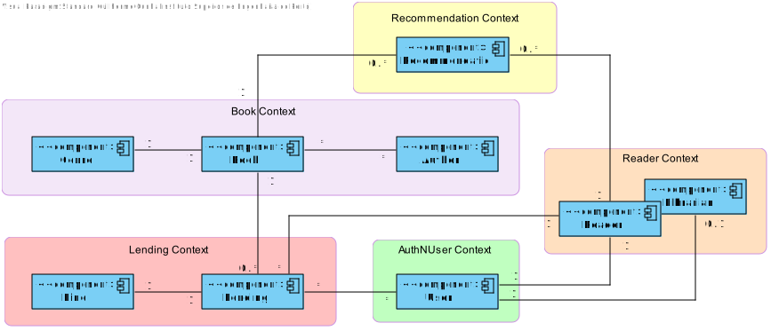
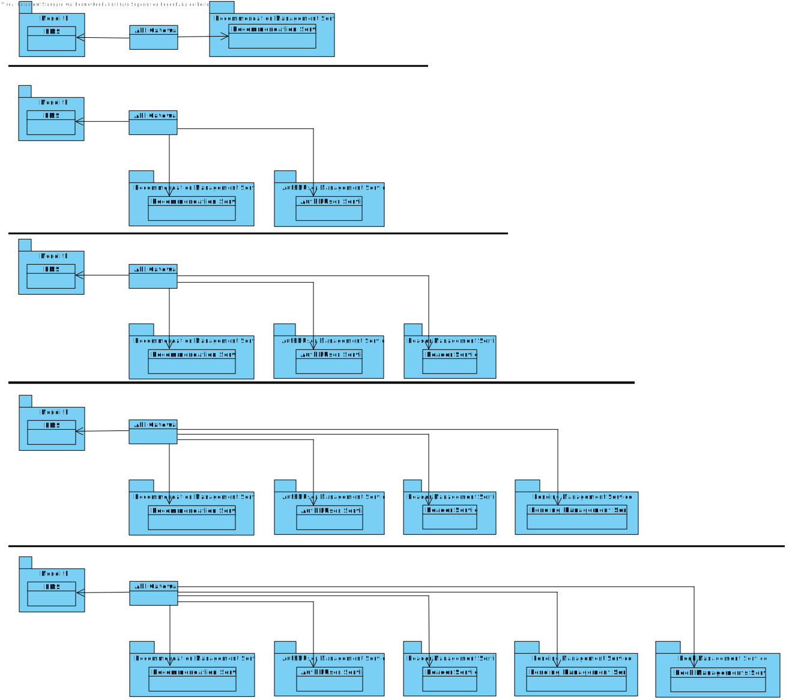

# Library Management System Analysis Document

_Central City_ library needs a system to manage their library, readers, and book lending. The library consists of
thousands of books
(no other media formats are available) organized by genre (e.g., Science-fiction, Mystery, Law, Medicine, etc.)
that readers can lend, take home, and return after a period (typically 15 days).

In the previous sprint, the below problems were addressed and fixed.

- Extensibility
- Configurability
- Modifiability

## Problem

Now the Library Management service faces the problems below:

- Availability
- Performance

## Introduction

The purpose of this document is to outline the architecture design of the new Library Management System, emphasizing key
attributes: availability and performance.

- **Availability:** The system should ensure continuous operation and resilience, maintaining service reliability under
  various conditions.

- **Performance:** The system needs to handle increased demand efficiently, optimizing resource use while ensuring
  responsiveness.

The design will also prioritize smooth updates, minimize disruptions to existing integrations, and align with the
company’s strategic goals for modular and connected services.

## Requirements (Drivers)

### Non-Functional Requirements

- The system must improve its availability.
- The system must increase the performance by 25% when in high demand (i.e. >Y
  requests/period).
- The system must use hardware parsimoniously, according to the run<me demanding of
  the system. Demanding peeks of >Y requests/period occur seldom.
- The system must maintain (or improve) releasability.
- The software clients should not be affected by the changes (if any) in the API, except in
  extreme cases.
- The system must adhere to the company’s SOA strategy of API-led connectivity

### Functional Requirements

- As a reader, upon returning a Book, I want to recommend it (positively or negatively).

| Use Case             | Description                                                                 |
|----------------------|-----------------------------------------------------------------------------|
| UC1 - Recommend Book | A reader can recommend a book (positively or negatively) upon returning it. |

### Constraints

| ID     | Constraint                                                                                                                                                                                                            |
|--------|-----------------------------------------------------------------------------------------------------------------------------------------------------------------------------------------------------------------------|
| CON-1  | The actual project is developed in Java, using Spring Boot framework.                                                                                                                                                 |
| CON-2  | Microservice architecture is needed.                                                                                                                                                                                  |
| CON-3  | The solution should follow a SOA strategy of API-led connectivity.                                                                                                                                                    |
| CON-4  | Design microservices with clear responsibilities, effective data handling, reliable communication, scalability, resilience, efficient deployment, robust security, optimized performance, and flexible configuration. |
| CON-5  | The system must ensure high availability at all times.                                                                                                                                                                | |
| CON-7  | The system must optimize resource usage, scaling hardware only during infrequent demand peaks.                                                                                                                        |
| CON-8  | The system must maintain or improve its releasability with each update.                                                                                                                                               |
| CON-9  | Changes to the API must not affect clients, except in extreme cases.                                                                                                                                                  |
| CON-10 | The system must adhere to the company’s SOA strategy, with API-led connectivity.                                                                                                                                      |

### Quality Attribute Scenarios

| **ID** | **Quality Attribute** | **Scenario**                                                                                                                                                                                                                                 | **Importance** | **Risk** |
|--------|-----------------------|----------------------------------------------------------------------------------------------------------------------------------------------------------------------------------------------------------------------------------------------|----------------|----------|
| QA-1   | Availability          | The system must be designed to handle high availability, ensuring minimal downtime even under heavy load. It should implement fault-tolerant mechanisms and failover strategies to maintain operational continuity.                          | H              | H        |
| QA-2   | Performance           | The system must improve its performance by 25% when under high demand (i.e., >Y requests/period). It should scale horizontally, implement caching strategies, and optimize resource allocation to meet these performance goals.              | H              | H        |
| QA-3   | Efficiency            | The system must use hardware efficiently, especially during demanding peaks of >Y requests/period. It should scale based on demand and ensure hardware resources (e.g., CPU, memory) are utilized optimally.                                 | H              | M        |
| QA-4   | Modifiability         | The system should maintain or improve its releasability by ensuring that updates, patches, and upgrades are seamless. Any changes in the API should not break client functionality except in extreme cases, ensuring backward compatibility. | H              | M        |
| QA-5   | Interoperability      | The system must adhere to the company’s SOA strategy of API-led connectivity, ensuring that all components communicate effectively and can integrate seamlessly with each other and with external systems.                                   | H              | M        |

## Iteration 3

### Step 2

#### Goal:

- Identification of all the bounded contexts for the project.

### Step 3

#### Elements to refine:

- System's domain

### Step 4

To transition to a microservices architecture, the "team" plans conduct a thorough analysis of the existing project and
its domain. This will involve applying Domain-Driven Design (DDD) patterns and identifying all bounded contexts, along
with their interactions. In this migration process, the team has decided to decompose the system based on business
capabilities and subdomains, adhering to key design principles.

The following bounded contexts have been identified:

* Books Context: This will encompass entities such as Authors, Genres, and Books themselves.
* AuthN Users Context: Responsible for user authentication and authorization.
* Lendings Context: Manages the processes related to book lending, including tracking loans, due dates, and return
  statuses.
* Reader Context: Covers all aspects related to the reader, such as profiles, borrowing history, and preferences.
* Recommendation Context: Focuses on recommending books based on reader behavior and preferences.

### BooksManagementContext

* The **Books context** encompasses the management of entities such as Authors, Genres, and the Books themselves. It is
  consumed by the Lendings, and Recommendation contexts but does not consume any other context.

### AuthNUsersManagementContext

* The **AuthN Users** context is responsible for user authentication and authorization management. It is consumed by the
  Reader context but does not consume any other context.

### LendingsManagementContext

* The **Lendings context** manages the book lending process, including tracking loans, due dates, and return statuses.
  It is consumed by the Reader and Books contexts but does not consume any other context.

### ReaderManagementContext

* The **Reader context** covers all aspects related to the reader, such as profiles, borrowing history, and preferences.
  It is consumed by the Lendings and Recommendation contexts but does not consume any other context.

### RecommendationManagementContext

* The **Recommendation context** focuses on recommending books based on reader behavior and preferences. It is consumed
  by the Books and Reader contexts but does not consume any other context.

### Rationale for Microservices Separation

#### Books Context

The **Books Context** includes entities such as **Book**, **Author**, and **Genre**. This grouping follows the
principles of **Domain-Driven Design (DDD)**, ensuring that all related operations and data management for books are
handled within the same context. By keeping **Author** and **Genre** within the **Books Context**, we maintain **domain
coherence**, ensuring that operations like book creation, genre classification, and author information are tightly
coupled and encapsulated.

#### AuthN Users Context

The **AuthN Users Context** handles user authentication and authorization. This context is separate from others to allow
focused and secure user management, which is critical for access control and user roles, such as readers and librarians.
Isolating this functionality ensures that user-related concerns do not interfere with other domain operations.

#### Lendings Context

The **Lendings Context** is dedicated to managing the borrowing and returning of books, tracking due dates, and
maintaining the return statuses. Isolating this context optimizes workflows specific to lending operations without
affecting other areas, such as user management or book recommendations.

#### Reader Context

The **Reader Context** is responsible for managing reader profiles, borrowing history, and preferences. Separating this
context allows for personalized services like book recommendations, while also ensuring that reader data is independent
from other domains, enabling more efficient handling of reader-related operations.

#### Recommendation Context

The **Recommendation Context** focuses on suggesting books based on reader behavior and preferences. By isolating this
context, we can improve scalability and adaptability, as the recommendation logic can evolve independently from core
operations like book lending or user management.

#### Design Principles

The separation of microservices follows key programming principles:

- **Domain-Driven Design (DDD)**: Ensures that each service has a clear, cohesive domain.
- **Single Responsibility Principle (SRP)**: Each microservice has a well-defined responsibility, reducing complexity.
- **Loose Coupling**: Microservices are loosely coupled, allowing independent evolution and scaling.
- **High Cohesion**: Related entities and logic are grouped together for better maintainability and clarity.

This structure promotes flexibility, scalability, and ease of maintenance in the system.

### Step 7

| Not Addressed | Partially Addressed | Completely Addressed | Design Decisions made during the Iteration                                       |
|---------------|---------------------|----------------------|----------------------------------------------------------------------------------|
| UC-1          |                     |                      | No significant decisions have been made at this stage.                           |
| QA-1          |                     |                      | No significant decisions have been made at this stage.                           |
| QA-2          |                     |                      | No significant decisions have been made at this stage.                           |
| QA-3          |                     |                      | No significant decisions have been made at this stage.                           |
|               | QA-4                |                      | Bounded context segregation visible in the context diagram. Technical Memo 1.1   |
| QA-5          |                     |                      | No significant decisions have been made at this stage.                           |
|               |                     | CON-1                | The technology was imposed by the client.                                        |
|               |                     | CON-2                | The architecture was imposed by the client.                                      |
|               | CON-3               |                      | The solution should follow a SOA strategy of API-led connectivity.               |
|               | CON-4               |                      | Microservice segregation visible in the context diagram.                         |
|               | CON-5               |                      | The system must ensure high availability at all times.                           |
| CON-7         |                     |                      | No significant decisions have been made at this stage.                           |
| CON-8         |                     |                      | No significant decisions have been made at this stage.                           |
| CON-9         |                     |                      | No significant decisions have been made at this stage.                           |
|               | CON-10              |                      | The system must adhere to the company’s SOA strategy, with API-led connectivity. |

## Iteration 4

### Step 2

#### Goal:

- Identification of all the microservices according to the bounded contexts defined in the previous iteration.

### Step 3

#### Elements to refine:

- System's domain

### Step 4

# System Architecture Overview

The system architecture is designed around **Bounded Contexts**, with each context corresponding to a dedicated
microservice. This approach ensures that each service is modular, with clear responsibilities, minimizing the impact of
changes on other components.

Each microservice is intentionally designed to be sufficiently self-contained, ensuring that modifications within one
service do not necessitate changes in others. However, we must avoid excessively small microservices that handle trivial
operations, as this could lead to performance degradation and negatively affect the system's overall quality.

A critical design requirement is the **consistent management of data** across the entire system. To achieve this, we
will employ **eventual consistency**, ensuring that data remains consistent across services without compromising system
performance or responsiveness.

To further enhance system decoupling, each microservice will have its own dedicated database. This architecture isolates
each service's database from others, preventing a failure or change in one database from impacting the others.

The **API Gateway** will serve as the entry point to the system, acting as a reverse proxy that communicates with one or
more microservices on behalf of the client. Additionally, it will support **API Composition**, aggregating data from
multiple services when necessary, which ensures that clients can access comprehensive information through a single API
call.

Based on the previously defined Bounded Contexts and architectural decisions, the following microservices have been
identified:

* **BooksManagementService:** Handles all book-related operations, including the management of authors, genres, and book
  metadata.
* **UserManagementService:** Manages authentication, user profiles, and access control for various roles.
* **LendingsManagement:** Service Responsible for tracking book loans, due dates, returns, and overdue statuses.
* **ReaderManagementService:** Manages reader profiles, borrowing history, preferences, and related data.
* **RecommendationService:** Provides personalized book recommendations based on reader behavior and preferences.
* **API Gateway / Load Balancer:** Facilitates load balancing and API aggregation, routing client requests to
  appropriate microservices.

This architecture promotes clear separation of concerns and enhances the system's scalability, flexibility, and
resilience. By adhering to these principles, we ensure that each microservice operates independently, supporting a
modular approach to system evolution while maintaining overall consistency and performance.

### Step 7

| Not Addressed | Partially Addressed | Completely Addressed | Design Decisions made during the Iteration                                       |
|---------------|---------------------|----------------------|----------------------------------------------------------------------------------|
| UC-1          |                     |                      | No significant decisions have been made at this stage.                           |
| QA-1          |                     |                      | No significant decisions have been made at this stage.                           |
| QA-2          |                     |                      | No significant decisions have been made at this stage.                           |
| QA-3          |                     |                      | No significant decisions have been made at this stage.                           |
|               | QA-4                |                      | Microservice segregation visible in the context diagram. Technical Memo 1.1      |
| QA-5          |                     |                      | No significant decisions have been made at this stage.                           |
|               |                     | CON-1                | The technology was imposed by the client.                                        |
|               |                     | CON-2                | The architecture was imposed by the client.                                      |
|               | CON-3               |                      | The solution should follow a SOA strategy of API-led connectivity.               |
|               | CON-4               |                      | Microservice segregation visible in the context diagram.                         |
|               | CON-5               |                      | The system must ensure high availability at all times.                           |
| CON-7         |                     |                      | No significant decisions have been made at this stage.                           |
| CON-8         |                     |                      | No significant decisions have been made at this stage.                           |
| CON-9         |                     |                      | No significant decisions have been made at this stage.                           |
|               | CON-10              |                      | The system must adhere to the company’s SOA strategy, with API-led connectivity. |

## Iteration 5

### Step 2

#### Goal:

- Determine the migration patterns to be implemented.

### Step 3

#### Elements to refine:

- Actual monolith system architeture

### Step 4

#### Microservices Migration Strategy

The application will be divided into microservices, as outlined in the project statement and described in **Technical
Memo 1.1**. This transition to a microservices architecture brings several key advantages:

- **Smaller and Faster Deployment**: With a smaller, more focused codebase, deployments can be executed faster, enabling
  quicker iterations and releases. This benefit aligns with the goal of **independent deployment and scaling** for each
  microservice as mentioned in **Technical Memo 1.1**, ensuring flexibility in managing resources according to
  individual service demands.
- **Improved Fault Isolation**: The decentralized nature of microservices means that a failure in one service is
  unlikely to affect others. This improves the **availability** and **reliability** of the system, ensuring that
  services can fail gracefully without compromising the overall system, which was a critical consideration in *
  *Technical Memo 1.1**.
- **Lowered Coupling**: As highlighted in the technical memo, the **loose coupling** between services facilitates easier
  updates and modifications. Changes to one service (e.g., adding new functionality) can be made independently without
  affecting other services, which reduces the risk of errors and ensures more manageable codebases.
- **Scalability**: Microservices provide better scalability by allowing specific services to scale according to their
  individual needs. For example, during high-demand periods, services like the **Recommendation service** may require
  more resources, while others such as **Lending** may remain unaffected. This decoupling aligns with the system’s *
  *independent scaling** strategy discussed in **Technical Memo 1.1**, which enables efficient resource allocation.

To migrate from the monolithic legacy system to a microservices architecture, we considered two migration patterns:

- **Strangler Fig Pattern**: As proposed in **Technical Memo 1.1**, the Strangler Fig pattern involves **incrementally
  replacing the monolithic system** with microservices, allowing for gradual migration over time. The steps for
  implementing this pattern are as follows:
    1. **Identification of the application's bounded contexts**: Determine the different business domains in the
       monolithic system.
    2. **Choosing the least costly bounded context to refactor**: Identify which domain to start with based on its
       complexity and integration challenges.
    3. **Designing the microservice**: Develop a microservice that encapsulates the chosen domain and adheres to *
       *Domain-Driven Design (DDD)** principles.
    4. **Implementing the microservice**: Build and deploy the new service, ensuring that it can operate alongside the
       monolithic system.

- **Parallel Full Redesign**: This pattern would involve creating the microservice architecture from scratch while
  leaving the existing monolithic system intact. The new system would be developed independently, following microservice
  principles. However, this pattern has significant drawbacks, as it leads to **waterfall development**, where the
  legacy system is untouched until the new system is fully built. This would increase development time and introduce
  significant integration challenges later in the process.

**Strangler Fig pattern** presents the challenge of running both the legacy and new systems simultaneously, it allows
for an incremental, less risky migration process. This approach minimizes disruptions to the users and ensures that the
legacy system can be fully replaced step-by-step, in line with the **loose coupling** and **independent deployment**
strategies outlined in **Technical Memo 1.1**.

By following the Strangler Fig pattern, we ensure that the system will evolve gradually, with minimal disruption, while
maintaining a clear separation of concerns between different business domains, as highlighted in the **Solution
Breakdown** of **Technical Memo 1.1**. This strategy will allow for **scalability**, **maintainability**, and *
*flexibility**, ensuring the system can grow with the project needs.

### Step 5 and 6

#### Decisions for Microservices Division

Based on the analysis of the system architecture and dependencies shown in the above Bounded Context diagram, we have
outlined the following decisions for dividing the system into microservices using the **Strangler Fig Pattern**:

##### 1. Start with Loosely Coupled Contexts

The **Recommendation Context** will be the first candidate for extraction. This context interacts primarily with the *
*Book Context** and has minimal inbound dependencies. Its loose coupling makes it easier to isolate as a standalone
service with minimal disruption to the rest of the system.

##### 2. Extract Foundational Services Early

The **AuthN/User Context**, which includes `User` and `Reader`, will be prioritized after the **Recommendation Context
**. This context is foundational, as it provides authentication and authorization functionalities for other parts of the
system. While this context has multiple downstream dependencies, it is critical to establish its independence early to
ensure secure and seamless communication for the rest of the system.

##### 3. Handle Moderately Coupled Contexts Next

The **Reader Context** will follow, as it is moderately coupled and depends on **AuthN/User Context**. Extracting this
context after the foundational services will streamline its migration by leveraging the independent authentication and
user functionality.

##### 4. Address Tightly Coupled Contexts Gradually

The **Lending Context** will be extracted after the **Reader Context** and **Book Context**. This context is tightly
coupled with both, requiring well-defined APIs or service calls to manage interactions effectively. Its migration will
involve ensuring data consistency and inter-service communication between lending, books, and readers.

##### 5. Extract the Central Book Context Last

The **Book Context**, which contains entities like `Book`, `Genre`, and `Author`, will be one of the last contexts to
migrate. Although it is central to the system and has multiple downstream dependencies (e.g., **Recommendation Context**
and **Lending Context**), it has fewer inbound dependencies, which simplifies its extraction once the associated
contexts have been migrated.

---

##### Rationale for the Approach:

- **Dependency Management**: By starting with contexts that have fewer inbound dependencies (e.g., **Recommendation
  Context**), we can reduce the complexity of changes required in the monolith early in the migration process.
- **Risk Mitigation**: Extracting foundational services like authentication early ensures a solid base for securely
  integrating other services.
- **Incremental Progress**: Gradually addressing more tightly coupled contexts (e.g., **Lending Context**) after loosely
  coupled ones minimizes the risk of breaking functionality during migration.
- **Smooth Transition**: By using proxy layers and APIs, existing calls to the monolith will be redirected seamlessly to
  the new microservices, ensuring uninterrupted system operations during the migration.

---

With this the process involved five gradual iterations that led the decomposition of the monolith into five distinct
services aligned with the bounded context defined in the steps above.

### Step 7

| Not Addressed | Partially Addressed | Completely Addressed | Design Decisions made during the Iteration                  |
|---------------|---------------------|----------------------|-------------------------------------------------------------|
|               | UC-1                |                      | Recommendation microservice added to the context.           |
| QA-1          |                     |                      | No significant decisions have been made at this stage.      |
| QA-2          |                     |                      | No significant decisions have been made at this stage.      |
| QA-3          |                     |                      | No significant decisions have been made at this stage.      |
|               | QA-4                |                      | No significant decisions have been made at this stage.      |
| QA-5          |                     |                      | No significant decisions have been made at this stage.      |
|               |                     | CON-1                | No significant decisions have been made at this stage.      |
|               |                     | CON-2                | No significant decisions have been made at this stage.      |
|               | CON-3               |                      | No significant decisions have been made at this stage.      |
|               | CON-4               |                      | No significant decisions have been made at this stage.      |
|               | CON-5               |                      | No significant decisions have been made at this stage.      |
| CON-7         |                     |                      | No significant decisions have been made at this stage.      |
| CON-8         |                     |                      | No significant decisions have been made at this stage.      |
|               | CON-9               |                      | No significant decisions have been made at this stage.      |
|               |                     | CON-10               | API Gateway will provide a central point for managing APIs. |

## Iteration 5

### Step 2

#### Goal:

- Define how the system must be designed to achieve high levels of availability, performance, efficiency, modifiability,
  and interoperability, ensuring seamless operation, scalability, and adaptability in diverse operational contexts.
  This includes maintaining continuous service availability, optimizing resource usage, scaling horizontally under high
  demand, supporting seamless updates with backward compatibility. More detailed information on Technical Memo 3.1.

### Step 3

#### Elements to refine:

- Microservices architecture defined in the previous iterations

### Step 4

#### Dividing Responsibilities to Improve Scalability, Maintainability, and System Efficiency

The application will be divided into microservices using a **Command-Query Responsibility Segregation (CQRS)** pattern,
**Database-per-Service** strategy, and **Polyglot Persistence** approach. This design ensures that the system is
scalable,
maintainable, and optimized for specific data handling requirements in each context.

#### Key Advantages

##### Separation of Concerns with CQRS

By splitting the system into Command and Query microservices, we can decouple write and read operations. This leads to:

- **Optimized Performance**: Each service can be tailored to handle its specific workload,
  such as using a write-optimized database for Command services and a read-optimized database for Query services.
- **Scalability**: Write-heavy and read-heavy parts of the system can scale independently based on their distinct needs.
- **Simplified Maintenance**: The separation ensures that updates or optimizations in one side of the system
  (e.g., Commands) do not disrupt the other (e.g., Queries).

##### Database-per-Service

Each microservice will have its own dedicated database, ensuring strict ownership and isolation of data. Benefits
include:

- **Improved Fault Isolation**: Failures or performance issues in one database will not propagate to others, enhancing
  system reliability.
- **Data Integrity**: Microservices own their data entirely, avoiding cross-service dependencies and reducing the risk
  of corruption.
- **Autonomous Evolution**: Each service can independently evolve its schema or switch to a database technology better
  suited for its specific needs.

##### Polyglot Persistence

Different microservices can use different types of databases (e.g., relational, NoSQL) based on their requirements. This
approach allows:

- **Flexibility**: Services like **Lending** may use a relational database (e.g., Postgres), while a **Recommendation**
  service could use a NoSQL database (e.g., MongoDB) to handle large-scale, unstructured data.
- **Better Performance**: Leveraging the strengths of specific database technologies results in better overall system
  performance and efficiency.

---

### Step 5 and 6

#### Decisions for Microservices Division

The system will be divided into microservices based on CQRS principles and the **Database-per-Service** strategy.
Each microservice will have a clear responsibility and ownership of its domain data.

##### Command Microservices

The **Command** microservices will handle all operations that change the state of the system. These include:

- **LendingCommandService**:
    - Handles operations like creating a lending record, updating lending statuses, and managing overdue fines.
    - Relies on a relational database (e.g., Postgres) for transaction consistency and data integrity.

- **ReaderCommandService**:
    - Manages user actions, such as registering a new reader or updating reader profiles.
    - Uses a relational database for structured data management.

##### Query Microservices

The **Query** microservices will focus on retrieving and presenting data. These include:

- **LendingQueryService**:
    - Retrieves information about current lendings, overdue lendings, and historical records.
    - Utilizes a NoSQL database (e.g., MongoDB) to provide faster and more flexible querying capabilities.

- **ReaderQueryService**:
    - Fetches detailed reader information.
    - Uses a document-oriented database like MongoDB for optimized data retrieval.

---

#### Rationale for Design Decisions

1. **CQRS for Domain Complexity**:

- Separating Commands and Queries simplifies the system architecture by reducing domain complexity.
- It ensures that services remain lightweight, focused, and highly specialized.

2. **Database-per-Service for Data Autonomy**:

- By assigning each microservice its own database, we eliminate the need for complex schema-sharing or synchronization
  across services.
- This isolation enables the services to scale independently, which is crucial for the **Recommendation** and **Lending
  ** contexts with varying demands.

3. **Polyglot Persistence for Flexibility**:

- Using different database technologies allows each service to optimize its storage and retrieval mechanisms for its
  specific use case.

4. **Resilience and Scalability**:

- Decoupling read and write operations allows the system to remain functional even if one part experiences high demand
  or failure.
- Each service can scale independently to match its workload, ensuring system stability during peak usage periods.

---

### Step 7

| Not Addressed | Partially Addressed | Completely Addressed | Design Decisions made during the Iteration                 |
|---------------|---------------------|----------------------|------------------------------------------------------------|
|               |                     | UC-1                 | Using the CON's defined previously we can achieve this UC. |
|               | QA-1                |                      | No significant decisions have been made at this stage.     |
|               | QA-2                |                      | No significant decisions have been made at this stage.     |
|               | QA-3                |                      | No significant decisions have been made at this stage.     |
|               | QA-4                |                      | No significant decisions have been made at this stage.     |
|               |                     | QA-5                 | No significant decisions have been made at this stage.     |
|               |                     | CON-1                | No significant decisions have been made at this stage.     |
|               |                     | CON-2                | No significant decisions have been made at this stage.     |
|               | CON-3               |                      | No significant decisions have been made at this stage.     |
|               |                     | CON-4                | With CQRS, database-per-service and polyglot persistence   |
|               | CON-5               |                      | No significant decisions have been made at this stage.     |
| CON-7         |                     |                      | No significant decisions have been made at this stage.     |
| CON-8         |                     |                      | No significant decisions have been made at this stage.     |
|               | CON-9               |                      | No significant decisions have been made at this stage.     |
|               |                     | CON-10               | No significant decisions have been made at this stage.     |

## Iteration 6

### Step 2

#### Goal:

- Define how can the Quality Attributes were achieved, alongside with the Constraints defined.

### Step 3

#### Elements to refine:

- QA-1, QA-2, QA-3, QA-4, CON-3, CON-5, CON-6, CON-7, CON-8, CON-9

### Step 4

#### Achieving Quality Attributes and Constraints

##### QA-1 and QA-3 Availability and Efficiency - Technical Memo 2.1

Ensuring high availability is critical for microservice-based systems to minimize downtime and maintain operational
continuity, even under heavy load or during system failures. By implementing Blue/Green Deployments, message queues like
RabbitMQ,
load balancing with NGINX, and orchestration with Docker Swarm, the system can achieve fault tolerance, failover
capabilities, and optimized performance.

###### Blue/Green Deployment

- **Maintain two environments** (Blue and Green) where one is live, and the other is a staging environment. Updates are
  deployed to the staging environment (Green) without affecting the live environment (Blue).
- **"Zero" Downtime**: Switch traffic from Blue to Green once testing is complete, ensuring users experience no downtime
  during deployments.
- **Rollback Capability**: In case of errors in the new deployment, traffic can be quickly redirected back to the stable
  environment.

###### Message Queue with RabbitMQ

- **Asynchronous Communication**: RabbitMQ ensures reliable communication between microservices by decoupling them
  through asynchronous messaging.
- **Message Persistence**: Persist messages in queues, preventing data loss during service outages or failures.
- **Load Balancing**: Distribute messages evenly across multiple instances of a microservice, avoiding bottlenecks and
  improving throughput.

###### Load Balancing with NGINX

- **Traffic Distribution**: NGINX ensures high availability by distributing incoming requests evenly across multiple
  instances of microservices.
- **Health Checks**: Continuously monitors the health of microservices, redirecting traffic away from failed or
  unresponsive instances.
- **Scalability**: Supports automatic scaling of backend services, optimizing the handling of fluctuating traffic loads.

###### Orchestration with Docker Swarm

- **Service Replication**: Docker Swarm replicates microservices across multiple nodes, ensuring redundancy. If one
  instance fails, others continue to serve requests.
- **Failover Mechanism**: Automatically detects and replaces unhealthy instances, maintaining consistent availability.
- **Dynamic Scaling**: Automatically adjusts the number of replicas based on traffic demands and performance metrics.
- **Network Overlay**: Provides secure communication between containers, ensuring seamless failover and service
  discovery.

##### QA-2 Performance - Technical Memo 2.1

The proposed strategies aim to address performance bottlenecks in systems with variable and high traffic periods,
such as when a considerable number of requests reach a microservice, ensuring that performance and response
times are not affected during peak times.

By leveraging **Docker Swarm**, **RabbitMQ**, and **Prometheus with Grafana**, the system will dynamically scale,
balance workloads, and monitor performance, ensuring optimized resource utilization and consistent availability even
during peak demand.

###### Docker Swarm

- **Dynamic Horizontal Scaling**: Deploy service replicas dynamically based on demand.
- **Auto-Scaling**: Trigger scaling actions based on real-time performance metrics.

###### RabbitMQ

- **Asynchronous Messaging**: Decouple services and reduce bottlenecks through asynchronous communication based on SAGA
  and Domain Events
- **Load Balancing**: Distribute workloads across service instances with:
    - Message persistence for reliability.
    - Dead-letter queues for error handling.

###### Prometheus & Grafana

- **Real-Time Metrics Collection**: Monitor CPU, memory, and response times via Prometheus.
- **Intuitive Dashboards**: Use Grafana to visualize metrics for proactive scaling and bottleneck identification.

###### Resource Optimization

- **Container Resource Limits**: Prevent over-provisioning by setting limits on CPU and memory usage.
- **Elastic Scaling**: Optimize hardware usage by scaling resources dynamically during traffic spikes.

##### QA-4 Performance - Technical Memo 2.1

Ensuring seamless updates and maintaining backward compatibility is critical for microservice-based systems to sustain
continuous delivery and avoid disruptions. By implementing API versioning, Blue/Green Deployments, feature toggles, and
contract testing, the system can ensure smooth upgrades, minimize downtime, and maintain client functionality.

###### API Versioning

- **Backward Compatibility**: Maintain multiple API versions to ensure existing clients continue functioning while new
  features are introduced.
- **Deprecation Policy**: Gradually phase out older API versions with clear communication to users, giving them time to
  migrate.

###### Blue/Green Deployment

- **Seamless Upgrades**: Use two environments (Blue and Green), where one remains live while the other is updated and
  tested.
- **Zero Downtime**: Shift user traffic to the updated environment (Green) only after ensuring it is stable.
- **Rollback Mechanism**: Quickly switch back to the previous environment (Blue) in case of issues, minimizing
  disruptions.

###### Contract Testing

- **Consumer-Driven Contracts**: Ensure that changes to microservices do not break client interactions by validating
  expectations between providers and consumers.
- **Automation**: Integrate contract tests into the CI/CD pipeline to catch breaking changes early in the development
  cycle.
- **Cross-Team Collaboration**: Foster collaboration between teams to align on API expectations and reduce
  misunderstandings.

| Not Addressed | Partially Addressed | Completely Addressed | Design Decisions made during the Iteration                                                                            |
|---------------|---------------------|----------------------|-----------------------------------------------------------------------------------------------------------------------|
|               |                     | UC-1                 | Using the CON's defined previously we can achieve this UC.                                                            |
|               |                     | QA-1                 | Ensure high availability with Blue/Green deployments, RabbitMQ, NGINX load balancing, and Docker Swarm orchestration. |
|               |                     | QA-2                 | Optimize performance with Docker Swarm, RabbitMQ, Prometheus, Grafana, and elastic scaling during peak traffic.       |
|               |                     | QA-3                 | No significant decisions have been made at this stage.                                                                |
|               |                     | QA-4                 | No significant decisions have been made at this stage.                                                                |
|               |                     | QA-5                 | No significant decisions have been made at this stage.                                                                |
|               |                     | CON-1                | No significant decisions have been made at this stage.                                                                |
|               |                     | CON-2                | No significant decisions have been made at this stage.                                                                |
|               |                     | CON-3                | No significant decisions have been made at this stage.                                                                |
|               |                     | CON-4                | With CQRS, database-per-service and polyglot persistence                                                              |
|               |                     | CON-5                | No significant decisions have been made at this stage.                                                                |
|               |                     | CON-7                | No significant decisions have been made at this stage.                                                                |
|               |                     | CON-8                | No significant decisions have been made at this stage.                                                                |
|               |                     | CON-9                | No significant decisions have been made at this stage.                                                                |
|               |                     | CON-10               | No significant decisions have been made at this stage.                                                                |
