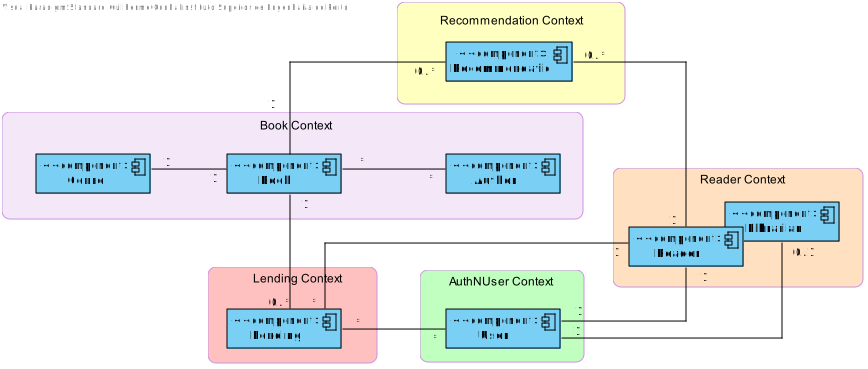

# Library Management System Analysis Document

_Central City_ library needs a system to manage their library, readers, and book lending. The library consists of
thousands of books
(no other media formats are available) organized by genre (e.g., Science-fiction, Mystery, Law, Medicine, etc.)
that readers can lend, take home, and return after a period (typically 15 days).

In the previous sprint, the below problems were addressed and fixed.

- Extensibility
- Configurability
- Modifiability

## Problem

Now the Library Management service faces the problems below:

- Availability
- Performance

## Introduction

The purpose of this document is to outline the architecture design of the new Library Management System, emphasizing key
attributes: availability and performance.

- **Availability:** The system should ensure continuous operation and resilience, maintaining service reliability under
  various conditions.

- **Performance:** The system needs to handle increased demand efficiently, optimizing resource use while ensuring
  responsiveness.

The design will also prioritize smooth updates, minimize disruptions to existing integrations, and align with the
company’s strategic goals for modular and connected services.

## Requirements (Drivers)

### Non-Functional Requirements

- The system must improve its availability.
- The system must increase the performance by 25% when in high demand (i.e. >Y
  requests/period).
- The system must use hardware parsimoniously, according to the run<me demanding of
  the system. Demanding peeks of >Y requests/period occur seldom.
- The system must maintain (or improve) releasability.
- The software clients should not be affected by the changes (if any) in the API, except in
  extreme cases.
- The system must adhere to the company’s SOA strategy of API-led connectivity

### Functional Requirements

- As a librarian, I want to create a Book, Author and Genre in the same process.
- As a reader, I want to suggest the acquisition of a new Book.
- As a reader, upon returning a Book, I want to recommend it (positively or negatively).

| Use Case                              | Description                                                                       |
|---------------------------------------|-----------------------------------------------------------------------------------|
| UC1 - Create Book, Author, and Genre. | A librarian must be able to create a book, author, and genre in a single process. |
| UC2 - Suggest new Book acquisition.   | A reader can suggest the acquisition of a new book for the library.               |
| UC3 - Recommend Book                  | A reader can recommend a book (positively or negatively) upon returning it.       |

### Constraints

| ID     | Constraint                                                                                                                                                                                                            |
|--------|-----------------------------------------------------------------------------------------------------------------------------------------------------------------------------------------------------------------------|
| CON-1  | The actual project is developed in Java, using Spring Boot framework.                                                                                                                                                 |
| CON-2  | Microservice architecture is needed.                                                                                                                                                                                  |
| CON-3  | The solution should follow a SOA strategy of API-led connectivity.                                                                                                                                                    |
| CON-4  | Design microservices with clear responsibilities, effective data handling, reliable communication, scalability, resilience, efficient deployment, robust security, optimized performance, and flexible configuration. |
| CON-5  | The system must ensure high availability at all times.                                                                                                                                                                |
| CON-6  | The system must handle high-demand periods efficiently, improving performance by 25% when necessary.                                                                                                                  |
| CON-7  | The system must optimize resource usage, scaling hardware only during infrequent demand peaks.                                                                                                                        |
| CON-8  | The system must maintain or improve its releasability with each update.                                                                                                                                               |
| CON-9  | Changes to the API must not affect clients, except in extreme cases.                                                                                                                                                  |
| CON-10 | The system must adhere to the company’s SOA strategy, with API-led connectivity.                                                                                                                                      |

### Quality Attribute Scenarios (Simplified)

| **ID** | **Quality Attribute** | **Scenario**                                                                                                                                                                                                                                 | **Importance** | **Risk** |
|--------|-----------------------|----------------------------------------------------------------------------------------------------------------------------------------------------------------------------------------------------------------------------------------------|----------------|----------|
| QA-1   | Availability          | The system must be designed to handle high availability, ensuring minimal downtime even under heavy load. It should implement fault-tolerant mechanisms and failover strategies to maintain operational continuity.                          | H              | H        |
| QA-2   | Performance           | The system must improve its performance by 25% when under high demand (i.e., >Y requests/period). It should scale horizontally, implement caching strategies, and optimize resource allocation to meet these performance goals.              | H              | H        |
| QA-3   | Efficiency            | The system must use hardware efficiently, especially during demanding peaks of >Y requests/period. It should scale based on demand and ensure hardware resources (e.g., CPU, memory) are utilized optimally.                                 | H              | M        |
| QA-4   | Modifiability         | The system should maintain or improve its releasability by ensuring that updates, patches, and upgrades are seamless. Any changes in the API should not break client functionality except in extreme cases, ensuring backward compatibility. | H              | M        |
| QA-5   | Interoperability      | The system must adhere to the company’s SOA strategy of API-led connectivity, ensuring that all components communicate effectively and can integrate seamlessly with each other and with external systems.                                   | H              | M        |

## Iteration 3

### Step 2

#### Goal:

- Identification of all the bounded contexts for the project.

### Step 3

#### Elements to refine:

- System's domain

### Step 4

To transition to a microservices architecture, the "team" plans conduct a thorough analysis of the existing project and
its domain. This will involve applying Domain-Driven Design (DDD) patterns and identifying all bounded contexts, along
with their interactions. In this migration process, the team has decided to decompose the system based on business
capabilities and subdomains, adhering to key design principles.

The following bounded contexts have been identified:

* Books Context: This will encompass entities such as Authors, Genres, and Books themselves.
* AuthN Users Context: Responsible for user authentication and authorization.
* Lendings Context: Manages the processes related to book lending, including tracking loans, due dates, and return
  statuses.
* Reader Context: Covers all aspects related to the reader, such as profiles, borrowing history, and preferences.
* Recommendation Context: Focuses on recommending books based on reader behavior and preferences.

### BooksManagementContext

* The **Books context** encompasses the management of entities such as Authors, Genres, and the Books themselves. It is
  consumed by the Lendings, and Recommendation contexts but does not consume any other context.

### AuthNUsersManagementContext

* The **AuthN Users** context is responsible for user authentication and authorization management. It is consumed by the
  Reader context but does not consume any other context.

### LendingsManagementContext

* The **Lendings context** manages the book lending process, including tracking loans, due dates, and return statuses.
  It is consumed by the Reader and Books contexts but does not consume any other context.

### ReaderManagementContext

* The **Reader context** covers all aspects related to the reader, such as profiles, borrowing history, and preferences.
  It is consumed by the Lendings and Recommendation contexts but does not consume any other context.

### RecommendationManagementContext

* The **Recommendation context** focuses on recommending books based on reader behavior and preferences. It is consumed
  by the Books and Reader contexts but does not consume any other context.

### Rationale for Microservices Separation

#### Books Context

The **Books Context** includes entities such as **Book**, **Author**, and **Genre**. This grouping follows the
principles of **Domain-Driven Design (DDD)**, ensuring that all related operations and data management for books are
handled within the same context. By keeping **Author** and **Genre** within the **Books Context**, we maintain **domain
coherence**, ensuring that operations like book creation, genre classification, and author information are tightly
coupled and encapsulated.

#### AuthN Users Context

The **AuthN Users Context** handles user authentication and authorization. This context is separate from others to allow
focused and secure user management, which is critical for access control and user roles, such as readers and librarians.
Isolating this functionality ensures that user-related concerns do not interfere with other domain operations.

#### Lendings Context

The **Lendings Context** is dedicated to managing the borrowing and returning of books, tracking due dates, and
maintaining the return statuses. Isolating this context optimizes workflows specific to lending operations without
affecting other areas, such as user management or book recommendations.

#### Reader Context

The **Reader Context** is responsible for managing reader profiles, borrowing history, and preferences. Separating this
context allows for personalized services like book recommendations, while also ensuring that reader data is independent
from other domains, enabling more efficient handling of reader-related operations.

#### Recommendation Context

The **Recommendation Context** focuses on suggesting books based on reader behavior and preferences. By isolating this
context, we can improve scalability and adaptability, as the recommendation logic can evolve independently from core
operations like book lending or user management.

#### Design Principles

The separation of microservices follows key programming principles:

- **Domain-Driven Design (DDD)**: Ensures that each service has a clear, cohesive domain.
- **Single Responsibility Principle (SRP)**: Each microservice has a well-defined responsibility, reducing complexity.
- **Loose Coupling**: Microservices are loosely coupled, allowing independent evolution and scaling.
- **High Cohesion**: Related entities and logic are grouped together for better maintainability and clarity.

This structure promotes flexibility, scalability, and ease of maintenance in the system.

### Step 7

| Not Addressed | Partially Addressed | Completely Addressed | Design Decisions made during the Iteration                                       |
|---------------|---------------------|----------------------|----------------------------------------------------------------------------------|
| UC-1          |                     |                      | No significant decisions have been made at this stage.                           |
| UC-2          |                     |                      | No significant decisions have been made at this stage.                           |
| UC-3          |                     |                      | No significant decisions have been made at this stage.                           |
| QA-1          |                     |                      | No significant decisions have been made at this stage.                           |
| QA-2          |                     |                      | No significant decisions have been made at this stage.                           |
| QA-3          |                     |                      | No significant decisions have been made at this stage.                           |
|               | QA-4                |                      | Bounded context segregation visible in the context diagram. Technical Memo 1.1   |
| QA-5          |                     |                      | No significant decisions have been made at this stage.                           |
|               |                     | CON-1                | The technology was imposed by the client.                                        |
|               |                     | CON-2                | The architecture was imposed by the client.                                      |
|               | CON-3               |                      | The solution should follow a SOA strategy of API-led connectivity.               |
|               | CON-4               |                      | Microservice segregation visible in the context diagram.                         |
|               | CON-5               |                      | The system must ensure high availability at all times.                           |
| CON-6         |                     |                      | No significant decisions have been made at this stage.                           |
| CON-7         |                     |                      | No significant decisions have been made at this stage.                           |
| CON-8         |                     |                      | No significant decisions have been made at this stage.                           |
| CON-9         |                     |                      | No significant decisions have been made at this stage.                           |
|               | CON-10              |                      | The system must adhere to the company’s SOA strategy, with API-led connectivity. |

## Iteration 4

### Step 2

#### Goal:

- Identification of all the microservices according to the bounded contexts defined in the previous iteration.

### Step 3

#### Elements to refine:

- System's domain

### Step 4

# System Architecture Overview

The system architecture is designed around **Bounded Contexts**, with each context corresponding to a dedicated microservice. This approach ensures that each service is modular, with clear responsibilities, minimizing the impact of changes on other components.

Each microservice is intentionally designed to be sufficiently self-contained, ensuring that modifications within one service do not necessitate changes in others. However, we must avoid excessively small microservices that handle trivial operations, as this could lead to performance degradation and negatively affect the system's overall quality.

A critical design requirement is the **consistent management of data** across the entire system. To achieve this, we will employ **eventual consistency**, ensuring that data remains consistent across services without compromising system performance or responsiveness.

To further enhance system decoupling, each microservice will have its own dedicated database. This architecture isolates each service's database from others, preventing a failure or change in one database from impacting the others.

The **API Gateway** will serve as the entry point to the system, acting as a reverse proxy that communicates with one or more microservices on behalf of the client. Additionally, it will support **API Composition**, aggregating data from multiple services when necessary, which ensures that clients can access comprehensive information through a single API call.

Based on the previously defined Bounded Contexts and architectural decisions, the following microservices have been identified:

* **BooksManagementService:** Handles all book-related operations, including the management of authors, genres, and book metadata.
* **UserManagementService:** Manages authentication, user profiles, and access control for various roles.        
* **LendingsManagement:** Service Responsible for tracking book loans, due dates, returns, and overdue statuses.     
* **ReaderManagementService:** Manages reader profiles, borrowing history, preferences, and related data.          
* **RecommendationService:** Provides personalized book recommendations based on reader behavior and preferences. 
* **API Gateway / Load Balancer:** Facilitates load balancing and API aggregation, routing client requests to appropriate microservices. 

This architecture promotes clear separation of concerns and enhances the system's scalability, flexibility, and resilience. By adhering to these principles, we ensure that each microservice operates independently, supporting a modular approach to system evolution while maintaining overall consistency and performance.

### Step 7

| Not Addressed | Partially Addressed | Completely Addressed | Design Decisions made during the Iteration                                       |
|---------------|---------------------|----------------------|----------------------------------------------------------------------------------|
| UC-1          |                     |                      | No significant decisions have been made at this stage.                           |
| UC-2          |                     |                      | No significant decisions have been made at this stage.                           |
| UC-3          |                     |                      | No significant decisions have been made at this stage.                           |
| QA-1          |                     |                      | No significant decisions have been made at this stage.                           |
| QA-2          |                     |                      | No significant decisions have been made at this stage.                           |
| QA-3          |                     |                      | No significant decisions have been made at this stage.                           |
|               | QA-4                |                      | Microservice segregation visible in the context diagram. Technical Memo 1.1      |
| QA-5          |                     |                      | No significant decisions have been made at this stage.                           |
|               |                     | CON-1                | The technology was imposed by the client.                                        |
|               |                     | CON-2                | The architecture was imposed by the client.                                      |
|               | CON-3               |                      | The solution should follow a SOA strategy of API-led connectivity.               |
|               | CON-4               |                      | Microservice segregation visible in the context diagram.                         |
|               | CON-5               |                      | The system must ensure high availability at all times.                           |
| CON-6         |                     |                      | No significant decisions have been made at this stage.                           |
| CON-7         |                     |                      | No significant decisions have been made at this stage.                           |
| CON-8         |                     |                      | No significant decisions have been made at this stage.                           |
| CON-9         |                     |                      | No significant decisions have been made at this stage.                           |
|               | CON-10              |                      | The system must adhere to the company’s SOA strategy, with API-led connectivity. |

