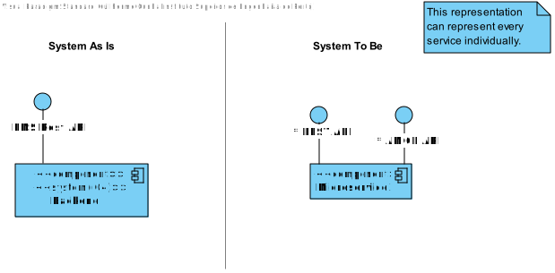
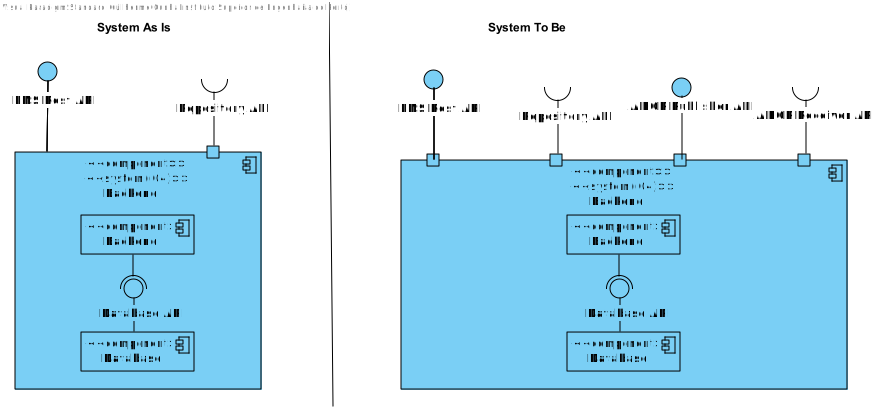
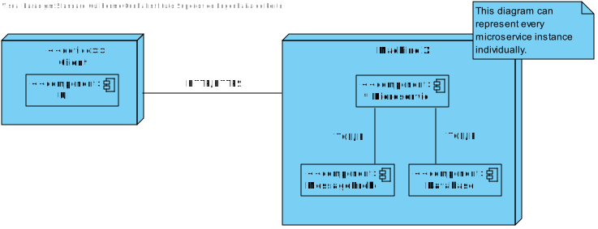
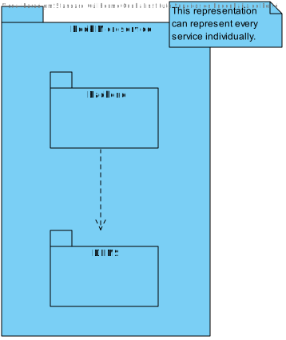
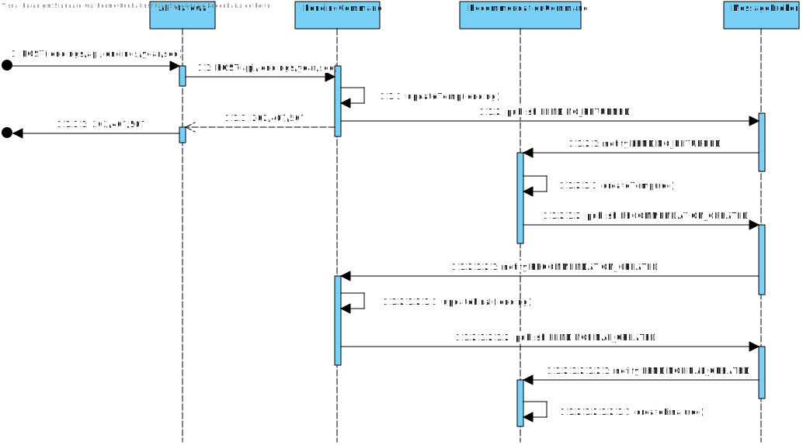
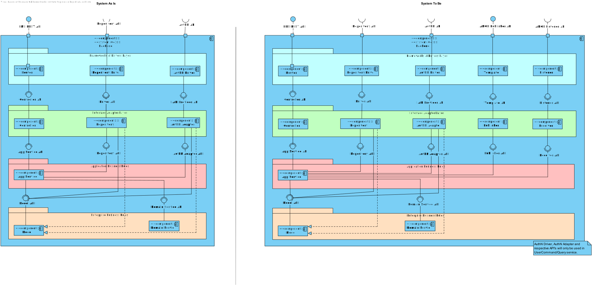
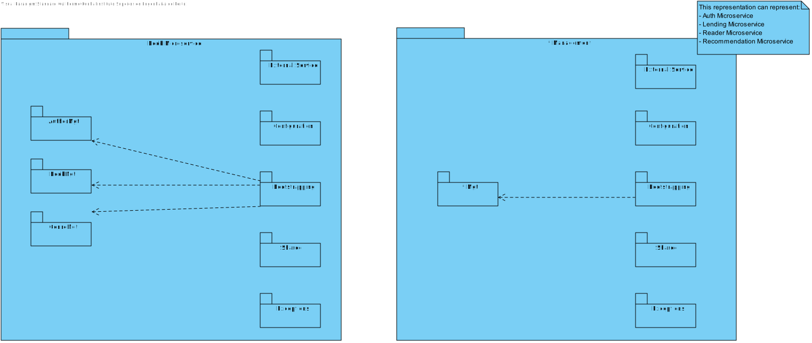
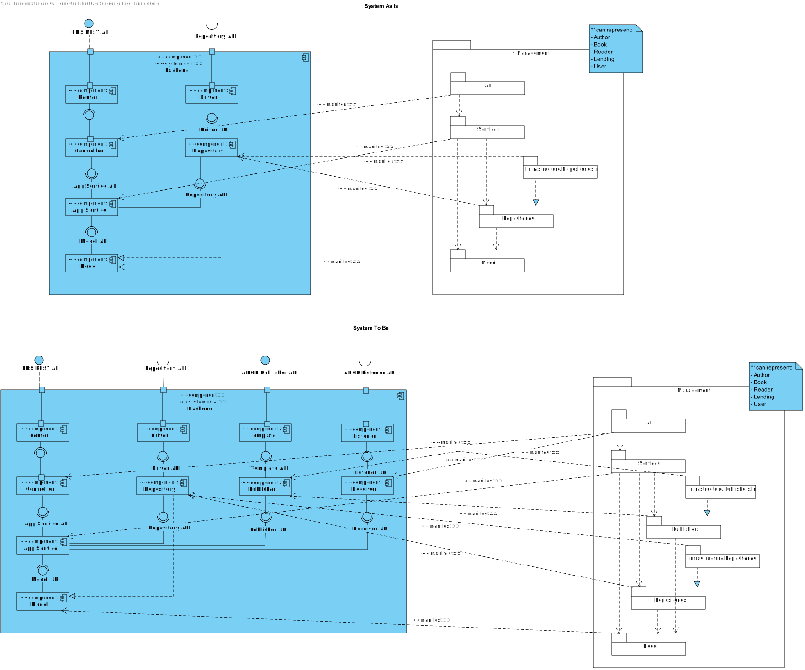
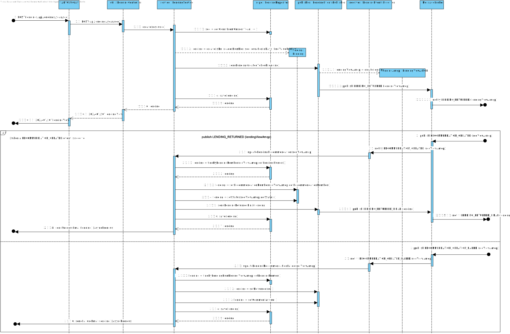
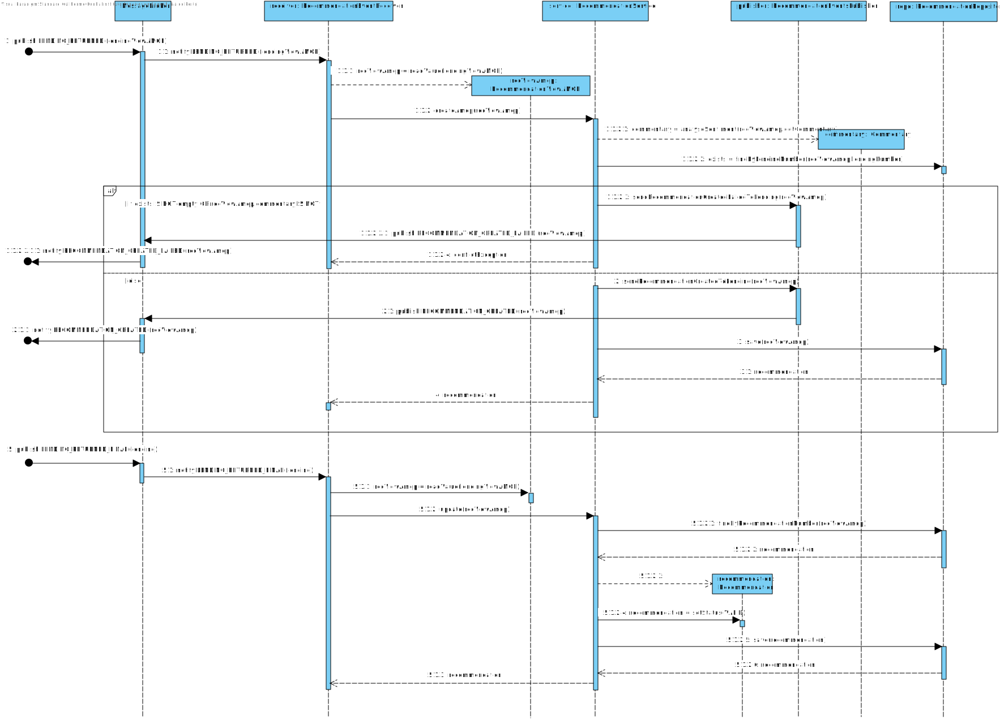

# System Architecture Design

## 1. Introduction

This document presents the system architecture design, offering a comprehensive overview of the project's structure, key components,
and interaction patterns. The architecture is crafted to ensure Extensibility, Configurability, and Modifiability, aligning 
with current project requirements and anticipated future needs.

## 2. System Overview

In response to evolving requirements, the system architecture has been restructured and is presented in two distinct views: 
"System As Is" and "System To Be." The "As Is" view represents the original architecture, while the "To Be" 
view illustrates the proposed future-state architecture.

### Domain Model

### 2.1 Level 1

#### 2.1.1 Logical View

### 2.2 Level 2

#### 2.2.1 Logical View

#### 2.2.2 Physical View

#### 2.2.3 Implementation View

#### 2.2.3 Process View - UC3

### Level 3

#### 2.3.1 Logical View

#### 2.3.2 Implementation View

##### 2.3.2.1 Implementation View NV4 vs Logival View NV3

#### 2.3.3 Implementation View

#### 2.3.4 Process View - UC3

##### ## Lending side of AMQP communication (Provider)

##### ## Recommendation side of AMQP communication (Consumer)

