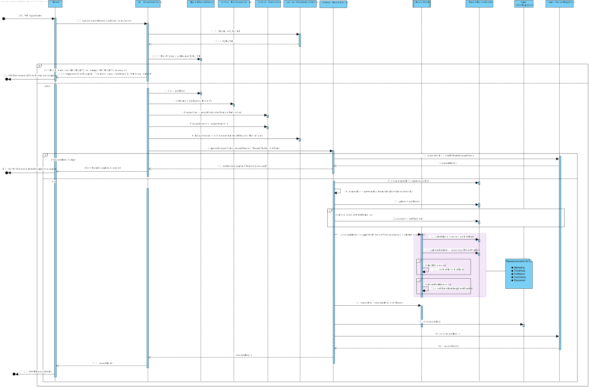

# Project

## Part 1
### DDD
- [x] Domain Model

### Roadmap

This project applies the Attribute-Driven Design (ADD) approach to enhance a library management backend service, with a focus on configurability, extensibility, and reliability. The system must support multiple data models, configurable identity management providers, flexible ID generation formats, and personalized lending recommendations.

### Technologies to use

##### Spring Boot

Spring boot is a framework that allows you to create a web application with minimal configuration. It is a project that is built on the top of the spring framework. It provides a faster and easier way to set up, configure, and run both simple and web-based applications.

##### JUnit
JUnit is a unit testing framework for the Java programming language. JUnit has been important in the development of test-driven development and is one of a family of unit testing frameworks which is collectively known as xUnit that originated with SUnit.

#### Postman
Since the application will have no frontend a tool to send requests to the app either for demonstration or for testing purpose is required. Postman is a collaboration platform for API development. Postman's features simplify each step of building an API and streamline collaboration so you can create better APIs—faster.

#### Docker
Docker is a set of platform as a service products that use OS-level virtualization to deliver software in packages called containers. Containers are isolated from one another and bundle their software, libraries, and configuration files; they can communicate with each other through well-defined channels.

#### MySQL
MySQL is an open-source relational database management system. Its name is a combination of "My", the name of co-founder Michael Widenius's daughter, and "SQL", the abbreviation for Structured Query Language.

#### MongoDB
MongoDB is a source-available cross-platform document-oriented database program. Classified as a NoSQL database program, MongoDB uses JSON-like documents with optional schemas.

#### Jenkins
Jenkins is a free and open-source automation server. It helps automate the parts of software development related to building, testing, and delivering, facilitating continuous integration and continuous delivery.

#### SonarQube
SonarQube is an open-source platform developed by SonarSource for continuous inspection of code quality to perform automatic reviews with static analysis of code to detect bugs, code smells, and security vulnerabilities on 20+ programming languages.

#### Git
Git is a distributed version-control system for tracking changes in source code during software development. It is designed for coordinating work among programmers, but it can be used to track changes in any set of files.

**Iteration 1**

- Goal: Structure the system (coarse architectural view)

- Description: In this iteration it is intended that the design of the software being developed is settled in a coarse architectural view

- Design Concepts:
    - Choose Reference Architectures
    - Choose Deployment Patterns
    - Choose Externally Developed Components (e.g. Frameworks)

**Iteration 2**

- Goal: Support primary functionality (fine-grain architectural view)

- Description: In this iteration it is intended that the design of the functional requirements and restrictions is settled in a fine-grain architectural view

- Design Concepts:
    - Choose Architectural Patterns
    - Relate Externally Developed Components with chosen Architectural Patterns

**Iteration 3**

- Goal: Support quality attribute scenarios and concerns

- Description: In this iteration it is intended that the design of the quality attribute scenarios and concerns is settled

- Design Concepts:
    - Analyze, and choose Tactics
    - Relate Architectural and Deployment Patterns with chosen Tactics
    - Relate Externally Developed Components with chosen Tactics

### Drivers

#### Use Cases
| ID    | Use Case                          | Description                                                                             | Priority | Appeared in         |
|-------|-----------------------------------|-----------------------------------------------------------------------------------------|----------|---------------------|
| UC1   | Register Author                   | Register author information including optional photo                                    | High     | Phase 1 WP#1A       |
| UC2   | Update Author                     | Update author’s information                                                             | High     | Phase 1 WP#1A       |
| UC3   | View Author Details               | View author details by author number (accessible to both librarians and readers)        | Medium   | Phase 1 WP#1A       |
| UC4   | Search Authors by Name            | Search for authors by name (accessible to both librarians and readers)                  | Low      | Phase 1 WP#1A       |
| UC5   | Register Book                     | Register a book with details such as ISBN, title, genre, description, and author(s)     | High     | Phase 1 WP#2A       |
| UC6   | Update Book                       | Update book information                                                                 | High     | Phase 1 WP#2A       |
| UC7   | View Book Details                 | View details of a book by ISBN (accessible to both librarians and readers)              | Medium   | Phase 1 WP#2A       |
| UC8   | Search Books by Genre             | Search books by genre (accessible to both librarians and readers)                       | Low      | Phase 1 WP#2A       |
| UC9   | Register Reader                   | Register a reader with details such as name, email, DOB, phone number, and GDPR consent | High     | Phase 1 WP#3A       |
| UC10  | Update Reader Details             | Update personal details (self-access for readers, no cross-access)                      | High     | Phase 1 WP#3A       |
| UC11  | View Reader Details               | View reader details by reader number (librarian access only)                            | Medium   | Phase 1 WP#3A       |
| UC12  | Search Readers by Name            | Search for readers by name (librarian access only)                                      | Low      | Phase 1 WP#3A       |
| UC13  | Lend Book                         | Lend a book to a reader with validation on overdue books and max lending count          | High     | Phase 1 WP#4A       |
| UC14  | Return Book                       | Return a book and apply fines for overdue returns                                       | High     | Phase 1 WP#4A       |
| UC15  | View Lending Details              | View lending details by lending number (accessible to both librarians and readers)      | Medium   | Phase 1 WP#4A       |
| UC16  | Add Genre                         | Bootstrap genre data                                                                    | High     | Phase 1 WP#0A       |
| UC17  | Add Librarian Credentials         | Bootstrap user credentials for librarians                                               | High     | Phase 1 WP#0A       |
| UC18  | Register Author with Photo        | Register author with an optional photo                                                  | Medium   | Phase 2 WP#1B       |
| UC19  | View Author’s Books               | View all books associated with a specific author                                        | Medium   | Phase 2 WP#1B       |
| UC20  | View Author’s Co-Authors          | View co-authors of an author and their respective books                                 | Low      | Phase 2 WP#1B       |
| UC21  | View Top 5 Authors                | View top 5 authors with the most lent books                                             | Medium   | Phase 2 WP#1B       |
| UC22  | Register Book with Cover Photo    | Register a book with an optional cover photo                                            | High     | Phase 2 WP#2B       |
| UC23  | Search Books by Title             | Search for books by title                                                               | Medium   | Phase 2 WP#2B       |
| UC24  | View Top 5 Books                  | View top 5 most-lent books                                                              | Medium   | Phase 2 WP#2B       |
| UC25  | View Top 5 Genres                 | View top 5 genres with the highest number of book lendings                              | Medium   | Phase 2 WP#2B       |
| UC26  | View Top 5 Readers                | View top 5 readers based on the number of books borrowed                                | Medium   | Phase 2 WP#3B       |
| UC27  | Register Reader with Interests    | Register reader with an optional genre interest list                                    | Medium   | Phase 2 WP#3B       |
| UC28  | Suggest Books for Reader          | Provide book suggestions based on reader's genre interests                              | Medium   | Phase 2 WP#3B       |
| UC29  | List Overdue Lendings             | List overdue lendings sorted by tardiness                                               | Medium   | Phase 2 WP#4B       |
| UC30  | Average Lendings per Genre        | View the average number of lendings per genre for a selected month                      | Medium   | Phase 2 WP#4B       |
| UC31  | Average Lending Duration          | View average lending duration                                                           | Medium   | Phase 2 WP#4B       |
| UC32  | Monthly Lending Count             | View the number of lendings per month, broken down by genre, over the last 12 months    | Medium   | Phase 2 WP#5        |
| UC33  | Top 5 Readers per Genre           | View top 5 readers by genre for a specific period                                       | Medium   | Phase 2 WP#5        |
| UC34  | Monthly Lending per Reader        | View monthly lending count per reader for a specific period                             | Medium   | Phase 2 WP#5        |
| UC35  | Average Lending Duration by Genre | View average lending duration per genre per month for a specific period                 | Medium   | Phase 2 WP#5        |

#### Non-Functional Requirements
- Persisting data in different data models (e.g. relational, document) and DBMS (e.g. MySQL, SQL Server, MongoDB, Redis);
- Adopting different IAM (Identity and Access Management) providers (e.g. Google, Facebook, Azure);
- Generating Lending and Authors ID in different formats according to varying specifications;
- Recommending Lendings according to varying specifications.

**Quality Attribute Scenarios**

| ID   | Quality Attribute | Scenario                                                                  | Associated Use Case | Priority |
|------|-------------------|---------------------------------------------------------------------------|---------------------|----------|
| QA-1 | Modifiability	    | The application must remain easy to modify                                | All Use Cases       | High     |
| QA-2 | Security          | The prototype requires authorization and authentication                   | All Use Cases       | High     |
| QA-3 | Usability         | The application should be accessible using an HTTP protocol               | All Use Cases       | High     |
| QA-4 | Testability       | Each component should be tested independently and within system workflows | All Use Cases       | High     |
| QA-5 | Reliability       | Ensure high availability and data concurrency handling                    | UC4, UC5            | Medium   |
| QA-6 | Performance       | The project should be 100% available to use                               | All Use Cases       | High     |
| QA-7 | Security          | All authenticated requests use JWT                                        | All Use Cases       | High     |
| QA-8 | Scalability       | Ability to handle large volumes of data asynchronously                    | UC6, UC8            | Medium   |
| QA-9 | Modifiability     | Runtime support for multiple data models and IAM providers                | All Use Cases       | High     |

#### Constraints

| ID    | Constraint                                                                                                                                                                                               |
|-------|----------------------------------------------------------------------------------------------------------------------------------------------------------------------------------------------------------|
| CON-1 | The actual project is developed in Java, using Spring Boot framework.                                                                                                                                    |
| CON-2 | The system must support relational databases, specifically H2, Oracle, and MS SQL Server, as well as document database MongoDB.                                                                          |
| CON-3 | The system must support multiple Identity and Access Management (IAM) providers, including Google IAM, Azure AD, and Facebook Login.                                                                     |
| CON-4 | The system must support runtime configuration, allowing for the dynamic application of alternative data models, IAM providers, and ID generation formats without requiring code changes or redeployment. |
| CON-5 | The system must be designed to support the implementation of automated functional testing, including unit opaque-box tests, mutation tests, integration tests, and acceptance tests.                     |
| CON-6 | The system should support any frontend.                                                                                                                                                                  |

**Concerns**

| ID    | Concern                                                                  | Description                                                                        |
|-------|--------------------------------------------------------------------------|------------------------------------------------------------------------------------|
| CRN-1 | Dynamic Configuration                                                    | Enable runtime configuration for data persistence and IAM selection.               |
| CRN-2 | Error Handling and Logging                                               | Implement consistent error handling and logging for all operations.                |
| CRN-3 | Monitoring and Observability                                             | Implement system health monitoring for load, error rates, and performance metrics. |
| CRN-4 | Input Validation.                                                        | --                                                                                 |
| CRN-5 | Allocate work to members of the development team                         | --                                                                                 |
| CRN-6 | Leverage the team’s knowledge about Java technologies, including Spring  | --                                                                                 |

## ADD

### Iteration 1
### Step 1 Review Inputs

| Scenario ID | Importance to the customer | Difficulty of implementation |
|-------------|----------------------------|------------------------------|
| QA-1        | Medium                     | Medium                       |
| QA-2        | High                       | High                         |
| QA-3        | Medium                     | Medium                       |
| QA-4        | High                       | Medium                       |
| QA-5        | High                       | High                         |
| QA-6        | High                       | Medium                       |
| QA-7        | Medium                     | Medium                       |
| QA-8        | High                       | High                         |
| QA-9        | High                       | High                         |

| Category                        | Details                                                                                                                                                   |
|---------------------------------|-----------------------------------------------------------------------------------------------------------------------------------------------------------|
| Design Purpose                  | A system from a mature domain is to be developed and it is necessary to produce a sufficiently detailed design to support the construction of the system. |
| Primary functional requirements | UC1, UC2, UC3, UC5, UC6, UC7, UC9, UC10, UC11, UC13, UC14, UC15,                                                                                          |
| Quality Attribute scenarios     | QA-1, QA-2, QA-3, QA-4, QA-7, QA-9                                                                                                                        |
| Constraints                     | All of the constraints previously presented are included as drivers                                                                                       |
| Architectural concerns          | All of the architectural concerns previously presented are included as drivers                                                                            |

### Step 2 Establish Iteration Goal by selecting drivers

Although this iteration is driven by a general architectural concern, the architect must keep in mind all the drivers that may influence the general structure of the system. In particular, the architect must be mindful of the following:

QA-1: Modifiability

QA-2; QA-7: Security

QA-3: Usability

QA-4: Testability

QA-9: Modifiability

CON-2: The system must support relational databases, specifically H2, Oracle, and MS SQL Server, as well as document database MongoDB.

CON-3: The system must support multiple Identity and Access Management (IAM) providers, including Google IAM, Azure AD, and Facebook Login.

CON-4: The system must support runtime configuration, allowing for the dynamic application of alternative data models, IAM providers, and ID generation formats without requiring code changes or redeployment.

CON-5: The system must be designed to support the implementation of automated functional testing, including unit opaque-box tests, mutation tests, integration tests, and acceptance tests.

CON-6: The system should support any frontend.

CRN-4: Input Validation.

CRN-6: Leverage the team’s knowledge about Java technologies, including Spring.

### Step 3 Choose one or more elements of the system to refine

The architect must choose one or more elements of the system to refine. In this iteration, the architect will focus on the following elements:

* LMS (Library Management Service), which is the backend, producing an interface that allows the consume of business logic functionalities.

* Database, which produces an interface that allows the store of information

### Step 4 Choose one or more design concepts that satisfy the selected drivers

The architect must choose one or more design concepts that satisfy the selected drivers. In this iteration, the architect will focus on the following design concepts:

* logically structure the client part of the system, it is not needed ti implement the frontend

* logically structure the server part of the system, spring boot system

* physically structure the application

The design concepts proposed are the following:

#### Logically Structure the Client Part of the System

| Design Decisions and Location     | Rationale                                                                                                                                                                                                                               |
|-----------------------------------|-----------------------------------------------------------------------------------------------------------------------------------------------------------------------------------------------------------------------------------------|
| Rich Internet Application (RIA)   | This reference architecture supports developing a rich user interface that runs within a web browser, providing a highly interactive experience. It also allows for easy upgrades and supports complex front-end functionalities.       |

#### Physically Structure the Application

| Design Decisions and Location                  | Rationale                                                                                                                                                                                                                         |
|------------------------------------------------|-----------------------------------------------------------------------------------------------------------------------------------------------------------------------------------------------------------------------------------|
| Three-Tier Deployment                          | This deployment pattern is a common choice for web applications, as it separates the presentation, application, and data management functions into distinct tiers. This separation allows for easier maintenance and scalability. |
| Use REST architectural style to define LMS API | REST is a popular architectural style for designing networked applications. It is lightweight, stateless, and scalable, making it an ideal choice for web applications. It also allows for easy integration with other systems.   |
| Onion Architecture for Core Domain Logic       | Onion Architecture is a layered architecture that separates the core domain logic from the application's infrastructure. This separation allows for easier testing, maintenance, and scalability.                                 |

#### Other Concepts

| Design Decisions and Location                                 | Rationale                                                                                                                                                                                                                                                                   |
|---------------------------------------------------------------|-----------------------------------------------------------------------------------------------------------------------------------------------------------------------------------------------------------------------------------------------------------------------------|
| Java Spring Framework for Backend Development                 | Spring Boot and Spring Data are selected for backend development. Spring Boot´s dependency injection supports Onion architecture, enabling modular and maintainable service layers. Spring Data provides flexible integration with relational and non-relational databases. |
| JWT with Spring Security for Authentication and Authorization | Spring Security with JWT provides secure and scalable authentication. This approach ensures robust security for API endpoints across services, aligning with non-functional requirements.                                                                                   |

### Step 5 Instantiate architectural elements, allocate responsibilities, and define interfaces

To satisfy the structure of the chosen design concepts, the following elements are proposal to be created:

| Design Decisions and Location                                           | Rationale                                                                                                              |
|-------------------------------------------------------------------------|------------------------------------------------------------------------------------------------------------------------|
| Map system elements to logical components                               | This will help to understand how each system element communicates with each other.                                     |
| Map system elements to physical components                              | This will help to understand how the system will be deployed and how the physical components interact with each other. |
| No need to create a module dedicated to the frontend of the application | The frontend is not needed, Postman will be used to communicate with the prototype API                                 |

### Step 6 Sketch views and record design decisions

**Component Diagram**

With a component diagram, it is possible to visualize the components of the system and how they interact with each other. The diagram below shows the components of the system and their relationships.

**Deployment Diagram**

The deployment diagram shows the physical components of the system and how they are deployed. The diagram below shows the deployment of the system in a three-tier architecture.

### Step 7 Perform analysis of current design and review iteration goal and achievement of design purpose

The architect must analyze the current design and review the iteration goal and the achievement of the design purpose. The architect must ensure that the design satisfies the drivers and constraints and that the design purpose is achieved.

#### Iteration Goal Review: Kanban Board Update

| Not Addressed | Partially Addressed | Completely Addressed | Design Decisions made during the Iteration                                                                                                                                              |
|---------------|---------------------|----------------------|-----------------------------------------------------------------------------------------------------------------------------------------------------------------------------------------|
|               | All Use Cases       |                      | Selected reference architecture establishes the modules that will support all functionalities                                                                                           |
|               |                     | QA-1                 | Selecting a layered architecture, developing new functionalities or removing deprecated ones becomes easier                                                                             |
| QA-2          |                     |                      | No important decisions was made. Spring Security with JWT was chosen to ensure secure authentication and authorization                                                                  |
|               | QA-3                |                      | The system will be deployed in a three-tier architecture, separating the presentation, application, and data layers                                                                     |
|               | QA-4                |                      | Selected reference architecture allows for the implementation of automated functional testing, including unit opaque-box tests, mutation tests, integration tests, and acceptance tests |
| QA-7          |                     |                      | No important decisions was made. Spring Security with JWT was chosen to ensure secure authentication and authorization                                                                  |
|               | QA-9                |                      | Selected reference architecture establishes the modules that will make the process of using different data models and IAM providers easier                                              |
|               | CON-1               |                      | The system will be developed in Java, using the Spring Boot framework                                                                                                                   |
|               | CON-2               |                      | The system will support relational databases, specifically H2, Oracle, and MS SQL Server, as well as document database MongoDB                                                          |
| CRN-4         |                     |                      | No relevant decisions were made                                                                                                                                                         |
|               | CRN-6               |                      | Technologies that have been considered up to this point take into account the knowledge of the developers                                                                               |

# Iteration 2

### Step 2  Establish iteration goal by selecting drivers

In this step the team will address the general architectural concern of identifying structures to support primary functionality.

In this second iteration, the following system´s primary use cases were considered:

* UC1
* UC2
* UC3
* UC5
* UC6
* UC7
* UC9
* UC10
* UC11
* UC13
* UC14
* UC15

### Step 3 Choose elements of the system to refine

In this iteration the elements to be refined are the modules located in the different layers defined by the reference architecture from the previous iteration. In general, the support of functionality in this system requires the collaboration of components associated with modules that are located in the different layers.

### Step 4 Choose one or more design concepts that satisfy the selected drivers

Given the iteration goal selected drivers in Step 2, it is necessary to define which design concepts will be taken in account to realize the elements to refine selected in Step 3. The design concepts proposed are the following:

| Design Decisions and Location                                    | Rationale                                                                                                                                                                                                                                                                                                                                                                                                                                                                       |
|------------------------------------------------------------------|---------------------------------------------------------------------------------------------------------------------------------------------------------------------------------------------------------------------------------------------------------------------------------------------------------------------------------------------------------------------------------------------------------------------------------------------------------------------------------|
| Create a Domain Model for the application                        | Before starting a functional decomposition, it is necessary to create an initial domain model for the system, identifying the major entities in the domainn, along with their relationships. A domain model must eventually be created, or it will emerge in a suboptimal fashion, leadingto an hoc architecture that is hard to understandand maintain                                                                                                                         |
| Identity Domain Objects that map to functional requirements      | Each distinct functional element of the application needs to be encapsulated in a self-contained building block -a domain object. One possivel alternative is to not considered domain objectsand instead directly decompose layers into modules, but this increases the risk of not considering a requirement                                                                                                                                                                  |
| Decompose Domain Objects into general and specialized Components | Domain objects represent complete sets of functionalities, Objects into general but this functionality is supported by ffiner-grained elements and specialized located within the layers. The "components" in this pattern Components are what we have referred to as modules. Specialization of modules is associated with the layers where they are located (e.g. UI modules). There are no good alternatives to decomposing the layers into modules to support functionality |
| Use Spring Framework                                             | Spring is a widely used framework to support enterprise application development                                                                                                                                                                                                                                                                                                                                                                                                 |
| Use Postman                                                      | Since there is no requirement for a frontend, Postman will be used to communicate with the prototype API                                                                                                                                                                                                                                                                                                                                                                        |

### Step 5 Instantiate architectural elements, allocate responsibilities, and define interfaces

| Design Decisions and Location                                                                                | Rationale                                                                                                                                                                                                                                                                                                                                                                                                                                   |
|--------------------------------------------------------------------------------------------------------------|---------------------------------------------------------------------------------------------------------------------------------------------------------------------------------------------------------------------------------------------------------------------------------------------------------------------------------------------------------------------------------------------------------------------------------------------|
| Create the domain model                                                                                      | The domain model will be created to identify the major entities in the domain, along with their relationships. This will help to understand the domain and support the functional decomposition of the system.                                                                                                                                                                                                                              |
| Elaborate use cases by actors                                                                                | To establish actors and their responsibilities it is necessary to map the use cases being addressed by their actors                                                                                                                                                                                                                                                                                                                         |
| Map the system use cases to domain objects                                                                   | An initial identification of domain objects can be made by analyzing the system´s use cases                                                                                                                                                                                                                                                                                                                                                 |
| Decompose the domain objects across the layers to identify layer-specific modules with an explicit interface | This technique ensures that modules that support all the functionalities are identified. The architect will perform this task just for the primary use cases. This allows another team member to identify the rest of the modules, thereby allocating work among team members. Having established the set of modules, the architect realizes the need to test these modules. To test these modules JUnit will be used to perform unit tests |
| Connect components associated with modules using Spring                                                      | This framework uses an inversion of control approach that allows different aspects to be supported and the modules to be unit tested. To test the modules, JUnit will be used to perform unit tests                                                                                                                                                                                                                                         |
| Map domain model using DDD                                                                                   | This help understanding how DDD should be applied in LMS                                                                                                                                                                                                                                                                                                                                                                                    |
| Elaborate LMS REST API                                                                                       | To explicit the specifications of the produced functionalities so consumers can understand how requests and responses are performed and structured                                                                                                                                                                                                                                                                                          |
| Explicit sequence of REST API functionalities in LMS component                                               | To understand the flux of each module interaction each time a functionality is requested                                                                                                                                                                                                                                                                                                                                                    |

### Step 6 Sketch views and record design decisions

**Domain Model**

**Class Diagram**

**DDD**

**Component Diagram**

**Sequence Diagram**

**Use Case Diagram**

**Responsibility Table for Defined Elements**

| Element        | Responsibility                                                          |
|----------------|-------------------------------------------------------------------------|
| Repository     | To provide a CRUD interface for the domain objects                      |
| RepositoryImpl | Represents the implementation of a Repository                           |
| Model          | Produces an interface that explicits model objects functionalities      |
| View           | Produces an interface that explicits view objects functionalities       |
| Controller     | Produces an interface that explicits controller objects functionalities |
| DomainEntities | Contains the entities from the domain model ( server side )             |

### Step 7 Perform analysis of current design and review iteration goal and achievements of design purpose

LMS was designed architecturally in a fine-grain view, which allowed the team to understand how each component units were being integrated.
A domain model was created to identify the major entities in the domain, along with their relationships. This helped to understand the domain and support the functional decomposition of the system.
A class diagram for the models that represent this business concepts was created, allowing the representation of the domain model in a more detailed way.
The DDD was applied to the domain model, allowing the team to understand how the domain model should be structured.

The following table represents design decisions made during the iteration:

| Not Addressed | Partially Addressed | Completely Addressed                                                  | Design Decisions made during the Iteration                                                                                                                                                         |
|---------------|---------------------|-----------------------------------------------------------------------|----------------------------------------------------------------------------------------------------------------------------------------------------------------------------------------------------|
|               |                     | UC1, UC2, UC3, UC5, UC6, UC7, UC9, UC10, UC11, UC12, UC13, UC14 ,UC15 | Modules across the layers                                                                                                                                                                          |
|               |                     | QA-1                                                                  | Domain model was created to identify the major entities in the domain, along with their relationships. This helped to understand the domain and support the functional decomposition of the system |
|               |                     | QA-2                                                                  | No important decisions was made. Spring Security with JWT was chosen to ensure secure authentication and authorization                                                                             |
|               |                     | QA-3                                                                  | Modules across the layers support thee using of HTTP                                                                                                                                               |
|               | QA-4                |                                                                       | No important decisions were made                                                                                                                                                                   |
| QA-7          |                     |                                                                       | No important decisions were made                                                                                                                                                                   |
|               | QA-9                |                                                                       | No important decisions were made                                                                                                                                                                   |
|               | CON-2               |                                                                       | No important decisions were made                                                                                                                                                                   |
| CRN-4         |                     |                                                                       | No relevant decisions were made                                                                                                                                                                    |
|               | CRN-6               |                                                                       | No relevant decisions were made                                                                                                                                                                    |

# Iteration 3 

### Step 2 Establish iteration goal by selecting drivers

In this third iteration the following system’s drivers were considered:

* Support the QA-2 quality attribute scenario (“The prototype requires authorization and authentication”)
* Support the QA-4 quality attribute scenario ("Each component should be tested independently and within system workflows")
* Support the QA-7 quality attribute scenario ("All authenticated requests use JWT")
* Support the QA-9 quality attribute scenario ("Runtime support for multiple data models and IAM providers")
* Support the CRN-4 architectural concern scenario ("Input Validation.")

### Step 3 Choose elements of the system to refine

